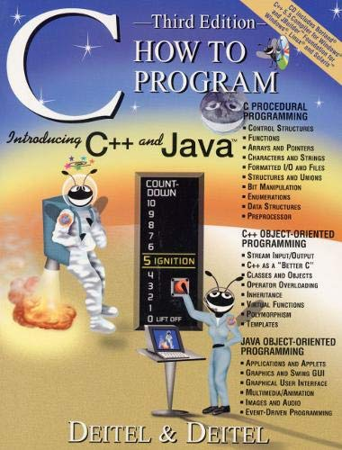

# C How to Program (3rd Edition)

Yes, this is a little bit old but I just want to remember C/C++ programming.
I was bought this book when I was fifteen, then I lost the book and bought
it again at 2022. Now I want to work on it.

Some function and variable names in Turkish because my book is translated
to Turkish. But I will write comments in English.



### Running programs with `rr` tool

The `rr` tool is just a bash script. This script directly compiles, executes and
removes the compiled file. Example usage:

```bash
./rr 4-control/405-for-loop.c
```

Result:

```bash
Toplam 2550
```
